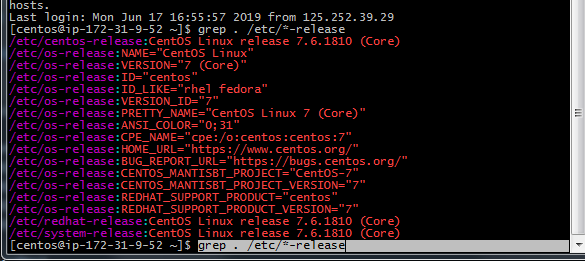
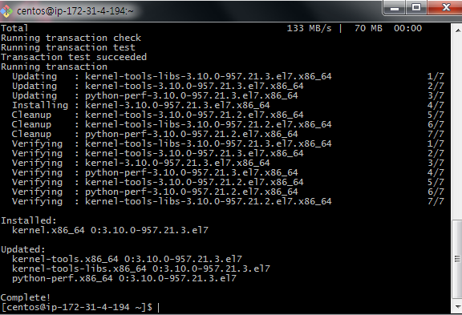

# 09277 박한주

# Local hosts setting

## local의 C:\Windows\System32\drivers\etc\hosts 파일 변경후 접속  (public)

```
파일 변경후 ssh -i skcc.pem centos@mn1

15.164.148.228  master01.cdhcluster.com mn1
15.164.152.209  util01.cdhcluster.com   util01
15.164.155.18   data01.cdhcluster.com   dn1
15.164.159.163  data02.cdhcluster.com   dn2
15.164.183.142  data03.cdhcluster.com   dn3

ssh -i skcc.pem  centos@mn1
ssh -i skcc.pem  centos@util01
ssh -i skcc.pem  centos@dn1
ssh -i skcc.pem  centos@dn2
ssh -i skcc.pem  centos@dn3
```


# 리눅스 버전 확인

```
grep . /etc/*-release

```


# linux bit 확인

```
getconf LONG_BIT
[centos@ip-172-31-9-52 ~]$ getconf LONG_BIT
64
```

# update yum 실행 및 확인

```
sudo yum update
sudo yum install -y wget

```


# cent os passwd 변경 및 ssh 설정 변경

```
sudo passwd centos
```


```
sudo vi /etc/ssh/sshd_config
```


```
sudo systemctl restart sshd.service
sudo systemctl status sshd.service
```


# /etc/hosts host 설정 

```
sudo vi /etc/hosts

172.31.13.249    master01.cdhcluster.com mn1
172.31.9.52     util01.cdhcluster.com   util01
172.31.1.120    data01.cdhcluster.com   dn1
172.31.1.108      data02.cdhcluster.com   dn2
172.31.4.194     data03.cdhcluster.com   dn3

```


# KEY gen

```
-- keygen 설정
cd .ssh

ssh-keygen -t rsa

```


```
ssh-copy-id -i ~/.ssh/id_rsa.pub mn1
ssh-copy-id -i ~/.ssh/id_rsa.pub dn1
ssh-copy-id -i ~/.ssh/id_rsa.pub dn2
ssh-copy-id -i ~/.ssh/id_rsa.pub dn3

ssh mn1 명령실행후 로그인 없이 로그인 여부 확인
```


# 각 host 별 hostname 변경 

```
hostname -f
sudo hostnamectl set-hostname master01.cdhcluster.com
sudo hostnamectl set-hostname util01.cdhcluster.com  
sudo hostnamectl set-hostname data01.cdhcluster.com  
sudo hostnamectl set-hostname data02.cdhcluster.com  
sudo hostnamectl set-hostname data03.cdhcluster.com  
hostname -f

init 6

```


# Install CM

```
util01 서버에 cm 설치 
[centos@util01 ~]$ hostname
util01.cdhcluster.com

A. Configure repository

# sudo wget https://archive.cloudera.com/cm5/redhat/7/x86_64/cm/cloudera-manager.repo \
-P /etc/yum.repos.d/

# sudo vi /etc/yum.repos.d/cloudera-manager.repo
>> baseurl=https://archive.cloudera.com/cm5/redhat/6/x86_64/cm/5.15.2/

# sudo rpm --import \
https://archive.cloudera.com/cm5/redhat/7/x86_64/cm/RPM-GPG-KEY-cloudera

```


# JDK 설치 (Util01)

## REPOSITORY 확인
```
# grep -i exclude /etc/yum.conf /etc/yum.repos.d/*
# yum repolist all
# yum list oracle*

```


## jdk 설치

```
sudo yum install oracle-j2sdk1.7
```


# util01에 Cloudera server 설치

```
hostname 확인

[centos@util01 etc]$ hostname
util01.cdhcluster.com

sudo yum install cloudera-manager-daemons cloudera-manager-server
```


# util01 마리아db설치

```
# hostname
# sudo yum install -y mariadb-server
# sudo systemctl enable mariadb
# sudo systemctl start mariadb
# sudo /usr/bin/mysql_secure_installation
>> admin 비번 : admin 세팅
```


# 모든 노드에 mysql-JDBC Connector 설치

```
# sudo wget https://dev.mysql.com/get/Downloads/Connector-J/mysql-connector-java-5.1.47.tar.gz

# tar zxvf mysql-connector-java-5.1.47.tar.gz
# sudo mkdir -p /usr/share/java/
# cd mysql-connector-java-5.1.47
# sudo cp mysql-connector-java-5.1.47-bin.jar /usr/share/java/mysql-connector-java.jar

# cd /usr/share/java/
# sudo yum install mysql-connector-java
>> Y

```


# 마리아 db DB,USER 생성

## maria DB Version 및 connect

```
# mysql --version 

[centos@util01 java]$ mysql --version
mysql  Ver 15.1 Distrib 5.5.60-MariaDB, for Linux (x86_64) using readline 5.1

# mysql -u root -p
```


## Database 확인

```
SHOW DATABASES;
```


## DB User create 

```
CREATE DATABASE scm DEFAULT CHARACTER SET utf8 DEFAULT COLLATE utf8_general_ci;
GRANT ALL ON scm.* TO 'scm-user'@'%' IDENTIFIED BY 'scm-user';

CREATE DATABASE amon DEFAULT CHARACTER SET utf8 DEFAULT COLLATE utf8_general_ci;
GRANT ALL ON amon.* TO 'amon-user'@'%' IDENTIFIED BY 'amon-user';

CREATE DATABASE rmon DEFAULT CHARACTER SET utf8 DEFAULT COLLATE utf8_general_ci;
GRANT ALL ON rmon.* TO 'rmon-user'@'%' IDENTIFIED BY 'rmon-user';

CREATE DATABASE hue DEFAULT CHARACTER SET utf8 DEFAULT COLLATE utf8_general_ci;
GRANT ALL ON hue.* TO 'hue-user'@'%' IDENTIFIED BY 'hue-user';

CREATE DATABASE metastore DEFAULT CHARACTER SET utf8 DEFAULT COLLATE utf8_general_ci;
GRANT ALL ON metastore.* TO 'metastore-user'@'%' IDENTIFIED BY 'metastore-user';

CREATE DATABASE sentry DEFAULT CHARACTER SET utf8 DEFAULT COLLATE utf8_general_ci;
GRANT ALL ON sentry.* TO 'sentry-user'@'%' IDENTIFIED BY 'sentry-user';

CREATE DATABASE oozie DEFAULT CHARACTER SET utf8 DEFAULT COLLATE utf8_general_ci;
GRANT ALL ON oozie.* TO 'oozie-user'@'%' IDENTIFIED BY 'oozie-user';

FLUSH PRIVILEGES;

```


# Setup the CM database


```
# sudo /usr/share/cmf/schema/scm_prepare_database.sh mysql scm scm-user scm-user
# sudo systemctl start cloudera-scm-server
# tail -f /var/log/cloudera-scm-server/cloudera-scm-server.log
```


# Cluster setup

## Cluster 설정


```
HOST 지정 및 설치 완료
```


## 기본 서비스 설치

```
서비스 별 HOST 설정.
```


```
DB 설정.
```


```
클러스터 내 서비스 Active 및 상태 확인
```


# 모든 노드에 training user 생성 & wheel group 에 추가

```
A. 모든 host에 아래 linux 계정 생성
cat /etc/passwd | grep training
sudo useradd training
sudo passwd training
sudo usermod -aG wheel training

B. 계정 그룹 설정 확인
getent group wheel
```


# HUE login

```
> http://util01:8889/
 ==> training/training user 생성
```

# training user login

```
su training 
```


# .sql file upload to util01

```
scp -i skcc.pem authors-23-04-2019-02-34-beta.sql training@util01:.

scp -i skcc.pem posts23-04-2019-02-44.sql training@util01:.
```


# trainig user 권한 추가 (util01)

```
mysql 로그인 후 training user에 권한 추가

mysql -u root -p 
GRANT ALL ON *.* TO 'training'@'%' IDENTIFIED BY 'training';
show grants for 'training'@'%';
```


# .sql파일 실행 및 테이블 생성 (mariaDB)


```
mysql -u training -p 
CREATE DATABASE test DEFAULT CHARACTER SET utf8 DEFAULT COLLATE utf8_general_ci;
```


##.sql파일 실행

```
source authors-23-04-2019-02-34-beta.sql
source posts23-04-2019-02-44.sql
```


## authors & posts 테이블 생성


# test database에 training 권한 부여

```
위에서 training 계정에 모든 db 접속 권한 부여 완료.
```

# Sqoop import

## util01 에 sqoop 1 client 추가


## sqoop으로 databases 확인

```
sqoop list-databases --connect jdbc:mysql://localhost --username training --password training
```


## authors sqoop import 실행( authors & posts)

```
sqoop import --connect jdbc:mysql://127.0.0.1/test --table authors --fields-terminated-by '\t' --username training --password training

sqoop import --connect jdbc:mysql://127.0.0.1/test --table posts --fields-terminated-by '\t' --username training --password training

```

# Impala 서비스 설치


