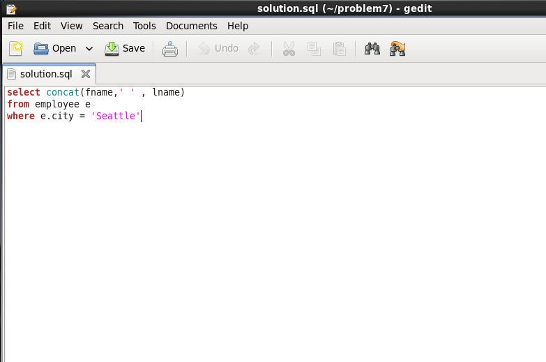
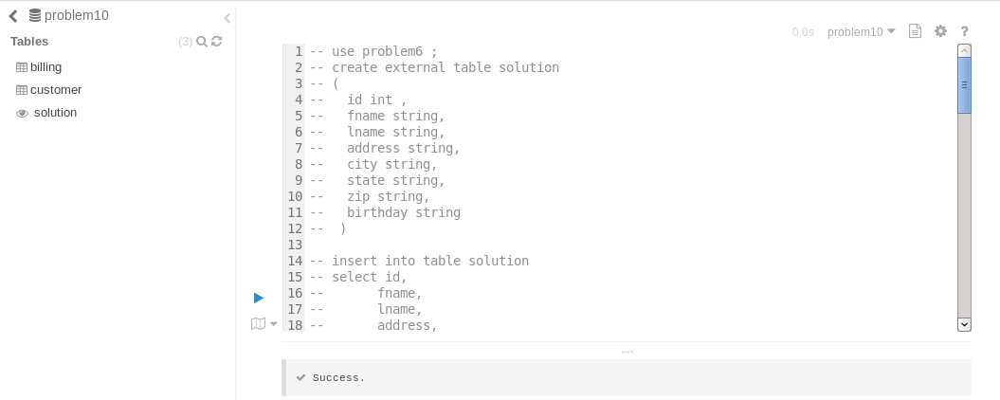
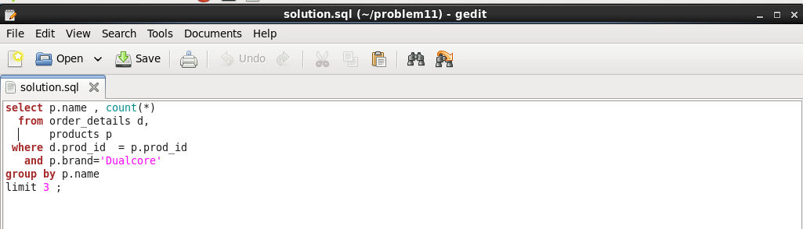

# 09277 박한주

# Problem1 

## 1. solution.sql

```
/home/training/problem1/solution.sql 저장

select a.id as id, 
       a.type as type,
       a.status as status,
       a.amount as amount,
       a.amount - w.average as different
from account a,
     (select type, avg(amount) as average from account group by type) w 
where status='Active'
and a.type = w.type

```


## 2. hive command execute

```
hive --database problem1 -f solution.sql
```


## 3. execute in hue web ui 


# Problem2 

## 1. query 

```
create database problem2;
use problem2;

create external table employees(
id INT, 
fname STRING,
lname STRING,
address STRING,
city STRING,
state STRING,
zip STRING,
birthday STRING,
hireday STRING)
 ROW FORMAT SERDE 'parquet.hive.serde.ParquetHiveSerDe'
  STORED AS 
    INPUTFORMAT "parquet.hive.DeprecatedParquetInputFormat"
    OUTPUTFORMAT "parquet.hive.DeprecatedParquetOutputFormat"
    LOCATION '/user/training/problem2/data/employee';
```

## 2. execute in hue web ui


# Problem3 

## 1. Create table

```
create external table solution
( id string, 
  fname string, 
  lname string, 
  hpnone string)
 ;
```


## 2. Insert data

```
insert into table problem3.solution
select c.id, c.fname, c.lname, c.hphone 
from account a,
     customer c 
where a.custid = c.id
and a.amount < 0 
```


## 3. result

```
select * from solution
limit 10;
```


# Problem4 

## 1. File 형식 확인
```
[training@localhost ~]$ hdfs dfs -cat /user/training/problem4/data/employee1/part-m-00000 | more
10000000	Olga	Booker	Ap #643-2741 Proin Street	Gresham	OR	42593-0000
10000001	Raja	Spence	P.O. Box 765, 7700 Eros Rd.	Duluth	MN	67110-0000
10000002	Meredith	Schwartz	3414 At Road	San Antonio	TX	35713-0000

[training@localhost ~]$ hdfs dfs -cat  /user/training/problem4/data/employee2/part-m-00000 | more
10010000,656,HULL,WARREN,7593 Pede. Rd.,Kansas City,MO,55725
10010001,142,HAYES,KASPER,425-3365 Feugiat Rd.,Springfield,MO,27927
10010002,417,BARRETT,SYBILL,Ap #367-7227 Eu Street,Hartford,CT,83690

```
## 2. PIG 를 활용해 데이터 추출


# Problem5 

## 1. solution.sql

```
select concat_ws('\t',fname , lname, city, state)
from customer c
where c.city = 'Palo Alto'
and   c.state = 'CA'
union all
select concat_ws('\t',fname , lname, city, state)
from employee e
where e.city = 'Palo Alto'
and   e.state = 'CA'
```


## 2. hive command execute

```
training/problem5 로 이동
hive --database problem5 -f solution.sql
```


# Problem6 

## 1. Table 생성 

```
use problem6;
create external table solution
(
  id int , 
  fname string,
  lname string, 
  address string,
  city string,
  state string,
  zip string,
  birthday string
 ) 
```
## 2. Data 생성

```
insert into table solution 
select id,
       fname,
       lname,
       address,
       city,
       state,
       zip,
       substr(birthday,1,5)
from employee;
```


# Problem7 

## 1.solution.sql
```
select concat(fname,' ' , lname)
from employee e
where e.city = 'Seattle'
```


## 2. hive command execute 

```
local problem7 폴더에 solution.sql 저장 후 
hive command 수행 
hive --database problem7 -f solution.sql
```


# Problem8 

## 1. Command Line

```
sqoop export \
--table solution \
--connect "jdbc:mysql://localhost/problem8" \
--username cloudera \
--password cloudera \
--export-dir "/user/training/problem8/data/customer/" \
--fields-terminated-by "\t" \
--columns "id, fname , lname , address , city, state , zip , birthday" ;
```


## 2. TABLE Select 결과

```
$ mysql -u cloudera -p

> show databases;
> use problem8;
> select * from solution limit 10;
```


# Problem9 

## 1. Create Table

```
use problem9 ;
create external table solution 
( 
 id string,
 fname string,
 lname string,
 address string,
 city string,
 state string,
 zip string,
 birthday string
);
```


## 2. Insert data & check

```
insert into solution
select distinct concat('A',id) as id,
       fname,
       lname,
       address,
       city,
       state,
       zip,
       birthday
from customer;

select* from solution limit 10;
```


# Problem10

## 1. Create VIEW
```
create view solution as
select c.id as id , 
       c.fname as fname, 
       c.lname as lname,
       c.city as city,
       c.state as state,
       b.charge as charge, 
       substr(b.tstamp,0,10) as billdate
from customer c , 
     billing b
where c.id = b.id 
;
```


## 2. Check data 
```
select *
from solution 
limit 10;
```


# Problem11

## A. Which top three products has Dualcore sold more of than any other?

### A-1 solution.sql
```
select p.name , count(*)
  from order_details d,
       products p
 where d.prod_id  = p.prod_id
   and p.brand='Dualcore'
group by p.name
limit 3 ;

```



### A-2. Hive command execute

```
hive --database default -f solution.sql
```


## B. Calculating Revenue and Profit – write a query to show Dualcore’s revenue (total price of products sold) and profit (price minus cost) by date.

### B-1. query

```
select to_date(o.order_date), 
       sum(p.price) as revenue , 
       sum(p.price - p.cost) as profit
  from orders o,
       order_details d,
       products p
 where o.order_id = d.order_id
   and d.prod_id  = p.prod_id
   and p.brand='Dualcore'
group by to_date(o.order_date);

```


## C. Calculating the order Total – Which ten orders had the highest total dollar amounts?

### C-1 Query

```
select o.order_id,
       sum(p.price) as total
  from orders o,
       order_details d,
       products p
 where o.order_id = d.order_id
   and d.prod_id  = p.prod_id
 group by o.order_id
 order by total desc
 limit 10;       
```
